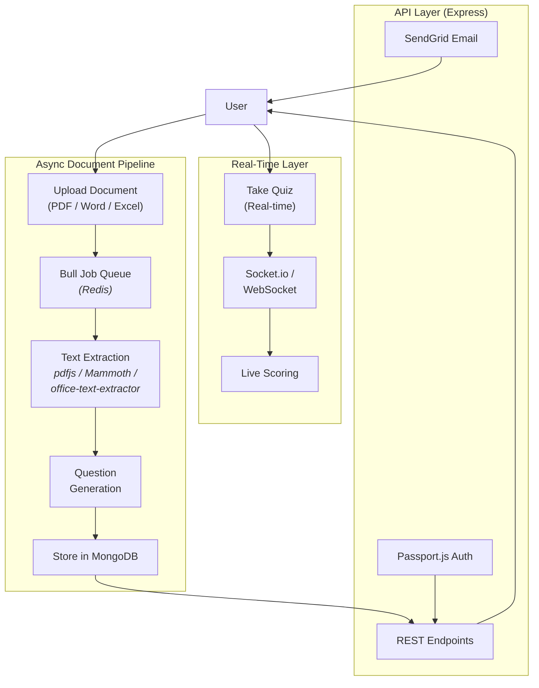

# Exquizite — Assessment Platform with Document Intelligence

A full-stack quiz and assessment platform that automatically generates questions from uploaded documents. Upload a PDF, Word doc, or Excel file → the system extracts text, processes it through an async job queue, and generates multiple-choice questions. Includes real-time quiz taking, user authentication, and email notifications.


## The Problem

Creating quality assessments is tedious. Educators and trainers spend hours writing questions from study material. Students want practice quizzes but have to make them manually from their notes and textbooks.

## What It Does

- **Document Upload & Processing** — Upload PDFs, Word documents (.docx), or Excel files. The system extracts text using format-specific parsers (pdfjs-dist, Mammoth, office-text-extractor).
- **Automatic Question Generation** — Extracted text is processed to generate multiple-choice questions. Runs asynchronously through a Bull/Redis job queue so uploads don't block the UI.
- **Real-Time Quiz Taking** — Socket.io enables live quiz sessions where multiple participants can take assessments simultaneously with real-time score updates.
- **Assessment Management** — Create, edit, and organize quizzes by topic. Track attempts and performance across users.
- **Authentication** — Passport.js with local strategy, bcrypt password hashing, and session management.
- **Email Notifications** — SendGrid integration for account verification and assessment invitations.

## Architecture



## Technical Highlights

- **Async Job Queue** — Document processing (extraction + question generation) runs through Bull backed by Redis. This means file uploads return immediately, and the heavy processing happens in the background. Users get notified when their questions are ready.
- **Multi-Format Document Parsing** — Three separate extraction pipelines for PDF (`pdfjs-dist`), Word (`mammoth`), and Excel (`office-text-extractor`). Each handles format-specific quirks (PDF layout, Word styling, Excel cell structure).
- **Real-Time Multiplayer** — Socket.io enables multiple users to take the same quiz simultaneously with live score tracking. WebSocket fallback for environments that don't support Socket.io.
- **Image Processing** — Sharp integration for handling image-based questions and document thumbnails.
- **Session-Based Auth** — Passport.js local strategy with bcrypt hashing, express-session for state management, and JWT for API authentication.

## Tech Stack

| Layer | Technology |
|-------|-----------|
| Runtime | Node.js |
| Framework | Express.js |
| Database | MongoDB + Mongoose |
| Job Queue | Bull (Redis-backed) |
| Real-Time | Socket.io, WebSocket |
| Auth | Passport.js (local strategy), bcrypt, JWT |
| Document Parsing | pdfjs-dist, Mammoth, office-text-extractor |
| Image Processing | Sharp |
| Email | SendGrid |
| Security | CORS, helmet, express-session |

## Data Models

```
User          — Profile, credentials, attempt history
Assessment    — Quiz metadata, settings, topic association
Question      — Question text, options, correct answer, source material
Attempt       — User responses, score, timing
Material      — Uploaded documents, extracted text, processing status
Topic         — Organizational grouping for assessments
```

## Running Locally

```bash
git clone https://github.com/thisisyoussef/exquizite.git
cd exquizite
npm install
```

You'll need:
- MongoDB instance (local or Atlas)
- Redis instance (for Bull job queue)
- SendGrid API key (for email)

```bash
cp .env.example .env  # Configure your credentials
npm start
```

## Project Structure

```
├── models/               # Mongoose schemas (User, Assessment, Question, etc.)
├── routes/               # Express route handlers
├── controllers/          # Business logic
├── services/             # External integrations (SendGrid, document parsers)
├── queues/               # Bull job definitions and processors
├── middleware/            # Auth, validation, error handling
├── sockets/              # Socket.io event handlers
└── utils/                # Helpers
```
